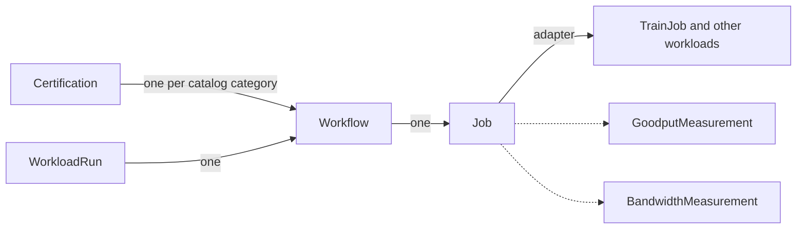

# NVIDIA Cluster Readiness Engine (NVCRE)

[](https://github.com/NVIDIA/cluster-readiness-engine/actions/workflows/ci.yml)
[](LICENSE)
[](go.mod)

New GPU clusters often contain faulty nodes, and those faults surface only under real distributed load. NVCRE is a Kubernetes controller that certifies GPU clusters before production workloads run on them. It runs real training and communication workloads across topology-aware node groups, measures performance, detects hardware failures, and reports every bad node with a reason. Quarantine is left to your platform: NVCRE never cordons, taints, or otherwise modifies a node.

NVCRE is for platform and infrastructure teams that bring up, validate, or resell GPU clusters.

## Features

- A certification catalog with NCCL communication tests and multi-node training workloads
- Platform detection (AWS, GCP, Azure, OCI, nscale, TogetherAI, Mistral, Forge, on-prem) and GPU architecture detection (GB200, GB300, H100, A100, L40S, L40)
- Goodput measurement parsed from training logs with configurable LogProfile patterns
- Per-bus bandwidth measurement parsed from NCCL logs
- Node health monitoring with CEL expressions while workloads run
- Per-node failure reporting with a reason for every failed node
- Topology-aware node grouping and adaptive fault isolation
- Checkpoint restart for training jobs
- WorkloadRun, a single resource to run a training, NCCL, or custom workload
- The `nvcrectl` CLI for setup, render, run, report, and cleanup

## How it works

The APIs compose like Deployment, ReplicaSet, and Pod:



A Certification creates one Workflow per catalog category. A WorkloadRun is the single-run entry point: it creates one Workflow directly from its inline workload spec, bypassing the catalog. This is what `nvcrectl workloadrun run` uses for ad-hoc workloads. Each Workflow creates a Job from its template. The Job creates the workload through an adapter, for example a Kubeflow Trainer TrainJob. Measurement resources parse pod logs with LogProfile regex patterns and compute goodput and bandwidth. When a node fails, NVCRE records it in the certification result with a reason. NVCRE does not modify nodes; quarantine is left to your platform.

## Quickstart

For complete prerequisites, installation, a first run, and cleanup, see
[Your first certification](docs/getting-started/first-certification.md).

**0. Check the cluster**

NVCRE requires the NVIDIA GPU Operator and, with the default metrics settings,
the Prometheus Operator CRDs that serve `monitoring.coreos.com/v1`; GB200 and
GB300 catalog entries also require the NVIDIA DRA driver for `ComputeDomain`
resources. The `diagnostics/dcgm-level4` category additionally requires the
standalone DCGM service, which the GPU Operator creates only when
`spec.dcgm.enabled` is true. Because the operator normally uses embedded DCGM
for metrics, standalone DCGM is off by default; enable it with:

```bash
kubectl patch clusterpolicy cluster-policy --type=merge \
  -p '{"spec":{"dcgm":{"enabled":true}}}'
```

Run `kubectl nvcre setup status` at any time to see what is present.

**1. Install the CLI**

```bash
curl -fsSL https://github.com/NVIDIA/cluster-readiness-engine/releases/latest/download/installer | bash
```

`releases/latest` resolves to the newest stable release. To pin a version, download
the installer from that release and pass the tag:

```bash
curl -fsSL https://github.com/NVIDIA/cluster-readiness-engine/releases/download/<tag>/installer | bash -s -- -v <tag>
```

The installer places `nvcrectl` on your `$PATH` and creates a `kubectl-nvcre` symlink so the CLI is also available as `kubectl nvcre`.

**2. Set up the cluster**

```bash
kubectl nvcre setup init
```

This installs Kubeflow Trainer, the NVCRE CRDs, the controller, and the built-in LogProfiles. The image and chart are public on GHCR; if your cluster pulls from a private mirror instead, pass `--image-pull-secret <github-token>` to create the pull secret.

**3. Certify**

```bash
kubectl nvcre certification run \
  --category communication/nccl-all-reduce \
  --wait
```

**4. Report**

The report prints when the run completes. To print it again later, pass the name and the namespace from the run output:

```bash
kubectl nvcre certification report <name> -n <namespace>
```

```
╔════════════════════════════════════════════════════════════════╗
║                      Certification Report                      ║
╚════════════════════════════════════════════════════════════════╝

  Name:      nvcrectl-20260806-162730
  Platform:  aws
  GPU:       gb300
  Nodes:     16

┌────────────────────────────────────────────────────────────────┐
│  communication/nccl-all-reduce                                 │
├────────────────────────────────────────────────────────────────┤
│  Status:    Succeeded                                          │
│  Runtime:   3m 56s                                             │
│  Scale:     full-scale                                         │
│  Nodes/Job: 16                                                 │
│  Jobs:      1                                                  │
│  MNNVL:     Enabled                                            │
│                                                                │
│  Bandwidth:                                                    │
│    Size       AlgBW        BusBW        Samples                │
│    16 GB      473.44 GB/s  932.09 GB/s  9                      │
└────────────────────────────────────────────────────────────────┘

┌────────────────────────────────────────────────────────────────┐
│  Summary                                                       │
├────────────────────────────────────────────────────────────────┤
│  Categories:   1/1 passed                                      │
│  Failed Nodes: none                                            │
│  Result:       PASSED                                          │
└────────────────────────────────────────────────────────────────┘
```

### Install from the registry instead

`setup init` above is the quickest path. If you would rather manage NVCRE with
Helm, or need to pin the controller image in your own manifests, both are
published to the GitHub Container Registry on every release.

```bash
# Resolve the newest stable release (no authentication needed)
NVCRE_VERSION=$(curl -fsSL https://api.github.com/repos/NVIDIA/cluster-readiness-engine/releases/latest | jq -re .tag_name)
: "${NVCRE_VERSION:?no stable release found}"

# Inspect the chart before installing it
helm show chart oci://ghcr.io/nvidia/cluster-readiness-engine --version "$NVCRE_VERSION"

helm install nvcre \
  oci://ghcr.io/nvidia/cluster-readiness-engine \
  --version "$NVCRE_VERSION" \
  --namespace nvcre \
  --create-namespace
```

By default, each Job, Workflow, Certification, and WorkloadRun controller runs
up to 10 reconciles concurrently, while each log-processing measurement
controller runs up to 5. Tune these limits for the controller resources and
Kubernetes API-server capacity available in your cluster:

```bash
helm upgrade nvcre \
  oci://ghcr.io/nvidia/cluster-readiness-engine \
  --version "$NVCRE_VERSION" \
  --namespace nvcre \
  --set manager.maxConcurrentReconciles=20 \
  --set manager.measurementMaxConcurrentReconciles=10
```

Both values must be greater than zero.

The controller image is `ghcr.io/nvidia/cluster-readiness-engine/manager`, tagged
with the same release version. Builds from `main` are also published, tagged
`main-<commit-sha>`; use a release tag rather than one of those.

The snippets above resolve the newest release. For reproducible installs, set
`NVCRE_VERSION` to an explicit tag instead. Chart and image versions move
together, so both commands and your own manifests should all name the same tag.

## Run a workload

WorkloadRun is a simplified API for running training, NCCL, or custom workloads. Write a YAML file with an image, a framework, and a node count. NVCRE detects the platform and GPU architecture. The quickest example is an NCCL bandwidth check:

```yaml
# nccl-all-reduce.yaml
apiVersion: nvcre.nvidia.com/v1alpha1
kind: WorkloadRun
metadata:
  name: nccl-all-reduce
spec:
  image: nvcr.io/nvidia/pytorch:26.01-py3
  numNodes: 4
  framework:
    mpi:
      binary: /usr/local/bin/all_reduce_perf_mpi
      mpirunPath: /usr/local/mpi/bin/mpirun
      args: ["-b", "8", "-e", "32G", "-f", "2", "-n", "100"]
  bandwidthMeasurement:
    logProfileRef: nccl-bandwidth
    testType: all_reduce
```

`numNodes` is the node count **per job group**, not the total: NVCRE partitions all
eligible nodes into groups of this size and runs one job per group, so
`numNodes: 4` on a 16-node cluster produces four 4-node jobs.

```bash
kubectl nvcre workloadrun run nccl-all-reduce.yaml --wait
```

For the full NCCL benchmark suite, see [Run NCCL Benchmarks](docs/how-to-guides/nccl-benchmarks.md).
For training workloads, see the [Nemotron 5](docs/how-to-guides/workloadrun-nemotron5.md) and
[DeepSeek-V3](docs/how-to-guides/workloadrun-deepseek-v3.md) quickstarts.

## Scope and non-goals

NVCRE certifies clusters with burn-in workloads and reports the nodes that fail. NVCRE is not:

- A continuous monitoring system. NVCRE watches nodes only while its workloads run.
- A general workload scheduler or a training platform for production pipelines.
- A benchmark leaderboard. The measurements exist to find faults, not to rank hardware.

## Documentation

- [Architecture Decision Records](docs/designs/) explain the design (ADR-000 to ADR-069).
- [CONTRIBUTING.md](CONTRIBUTING.md) describes the contribution workflow.
- [GOVERNANCE.md](GOVERNANCE.md) and [MAINTAINERS.md](MAINTAINERS.md) describe who decides what.
- [RELEASE.md](RELEASE.md) describes how a release is cut and how to verify one.
- [SECURITY.md](SECURITY.md) describes how to report a vulnerability.

A hosted documentation site is in progress.

## Roadmap

- Hosted documentation site

## Community

- Ask questions in [GitHub Discussions](https://github.com/NVIDIA/cluster-readiness-engine/discussions).
- Report bugs and request features with the [issue templates](https://github.com/NVIDIA/cluster-readiness-engine/issues/new/choose).
- Report security issues per [SECURITY.md](SECURITY.md), never through GitHub issues.
- We follow the [Contributor Covenant Code of Conduct](CODE_OF_CONDUCT.md).

## Development

```bash
make manifests generate    # Regenerate CRDs and DeepCopy
make lint                  # Lint
make test                  # Unit + integration tests
make build                 # Build binary
```

Read [CONTRIBUTING.md](CONTRIBUTING.md) before you open a pull request. Open an issue first, and sign your commits with `git commit -s`.

## License

Copyright (c) 2026 NVIDIA CORPORATION & AFFILIATES. All rights reserved. Licensed under the Apache License, Version 2.0. See [LICENSE](LICENSE) for details. Third-party attributions are in [THIRD_PARTY_NOTICES.md](THIRD_PARTY_NOTICES.md).
